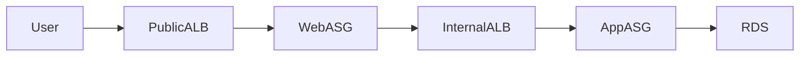

# 🚀 Terraform + Ansible Multi-Tier Student Management System

```{=html}
<p align="center">
```
``{=html}
```{=html}
</p>
```
## 🎯 What This Project Demonstrates

A production-style **3-tier AWS architecture** built using **Terraform
(IaC)** and **Ansible (Configuration Management)** to deploy a
full-stack **React + Spring Boot + MySQL** application with:

-   High Availability (Multi-AZ)
-   Auto Scaling
-   Secure Private Networking
-   Internal & Public Load Balancers
-   Remote Terraform State Management

This project simulates how real enterprise applications are deployed in
the cloud.

------------------------------------------------------------------------

## 🏗 Architecture Overview



------------------------------------------------------------------------

## 🔁 Request Flow

1.  User hits **Public ALB**
2.  Traffic routed to **Web Tier (Nginx + React)**
3.  React calls `/api/*`
4.  Nginx forwards to **Internal ALB**
5.  Internal ALB routes to **Spring Boot App**
6.  App connects to **RDS MySQL (Private Subnet)**

------------------------------------------------------------------------

## 🛠 Tech Stack

### Frontend

-   React (Vite)
-   Axios
-   Nginx (Reverse Proxy)

### Backend

-   Spring Boot
-   Java 17
-   Maven

### Database

-   Amazon RDS (MySQL Multi-AZ)

### Infrastructure

-   AWS VPC (Public & Private Subnets)
-   Internet Gateway
-   NAT Gateway
-   Application Load Balancers (Public + Internal)
-   Auto Scaling Groups
-   EC2 (Amazon Linux 2023)
-   S3 (Terraform Backend)
-   DynamoDB (State Locking)

### DevOps

-   Terraform
-   Ansible
-   Cloud-Init

------------------------------------------------------------------------

## ⭐ Key Features

-   3-Tier Architecture (Web → App → DB)
-   Multi-AZ High Availability
-   Auto Scaling (CPU-based scaling policies)
-   Secure Network Segmentation
-   Internal Load Balancing (App tier private)
-   Infrastructure as Code (100% Terraform)
-   Automated Server Configuration (Ansible)

------------------------------------------------------------------------

## 📦 Deployment (Quick Overview)

``` bash
# Setup remote backend (one-time)
cd terraform-backend
terraform init
terraform apply

# Deploy infrastructure
cd ../terraform-infra
terraform init
terraform apply
```

Get public endpoint:

``` bash
terraform output public_alb_dns
```

------------------------------------------------------------------------

## 🔐 Security Highlights

-   RDS in Private Subnets
-   App Tier isolated from internet
-   Internal ALB not publicly accessible
-   DB only accessible from App Security Group
-   Encrypted Terraform state in S3
-   DynamoDB state locking

------------------------------------------------------------------------

## 🛣 Future Improvements

-   HTTPS with ACM
-   CI/CD Pipeline (GitHub Actions)
-   CloudWatch Monitoring & Alerts
-   WAF integration
-   Docker + EKS Deployment

------------------------------------------------------------------------

## 👨‍💻 Author

**Pranit Potsure**\
Cloud & DevOps Engineer

🔗 LinkedIn: https://linkedin.com/in/pranit-potsure\
🔗 GitHub: https://github.com/pranitpotsure

------------------------------------------------------------------------

⭐ If you found this project useful, consider giving it a star!
